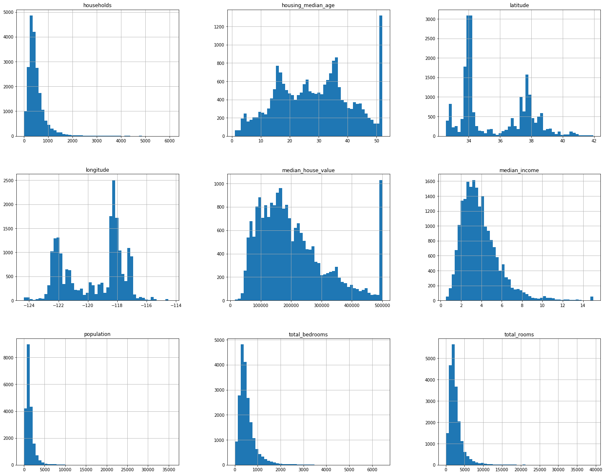
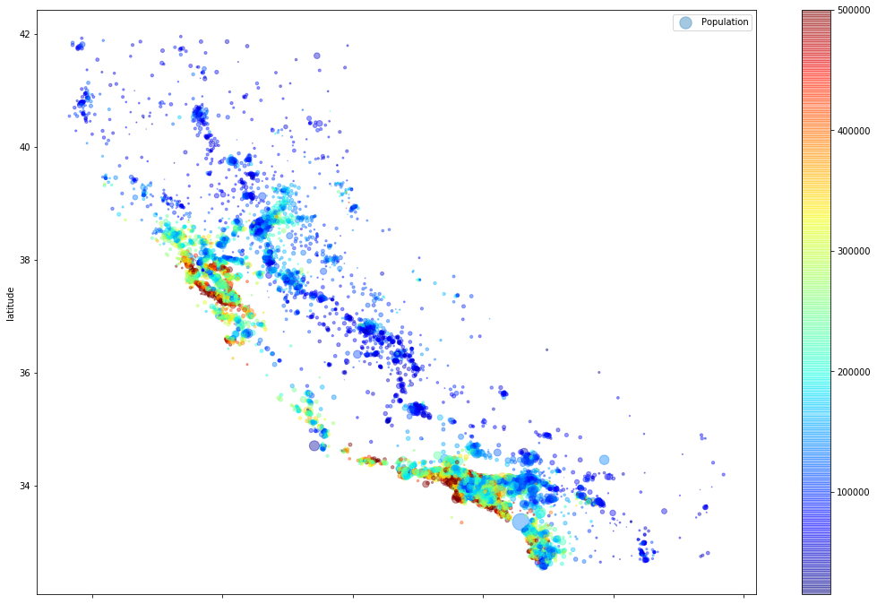
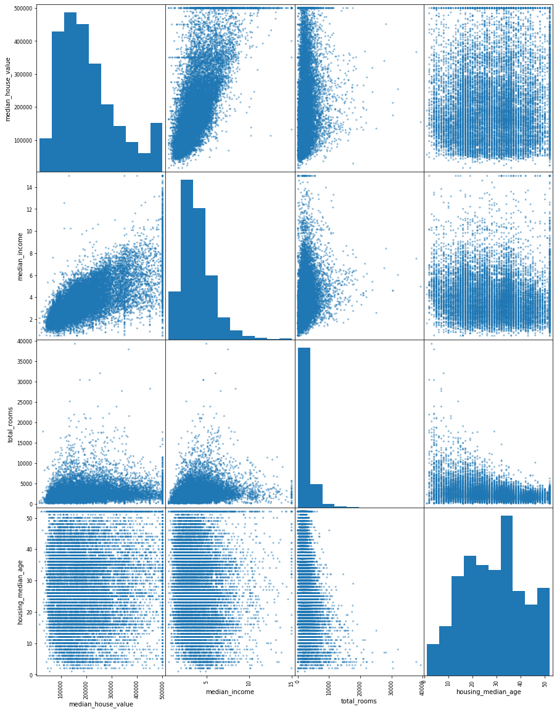

```python
#Get data for tarfile in Github, extract it in datasets/housing:
import os
import tarfile
from six.moves import urllib

DOWNLOAD_ROOT = "https://raw.githubusercontent.com/ageron/handson-ml/master/"
HOUSING_PATH = os.path.join("datasets","housing")
HOUSING_URL = DOWNLOAD_ROOT + HOUSING_PATH + "/housing.tgz"

#function to read tarfile and unzip it. And save in datasets/housing
def getdata(housing_url = HOUSING_URL, housing_path = HOUSING_PATH):
    if not os.path.isdir(housing_path):
        os.makedirs(housing_path)
    tgzpath = os.path.join(housing_path, "housing.tgz")
    urllib.request.urlretrieve(housing_url, tgzpath)
    housing_tgz = tarfile.open(tgzpath)
    housing_tgz.extractall(path = housing_path)
    housing_tgz.close()
    
housing = getdata()
```


```python
#From datasets/housing read housing.csv as pd Dataframe. 
import pandas as pd

file_path = os.path.join("datasets/housing", "housing.csv")

def readcsv(path = file_path):
    return pd.read_csv(path)

housing = readcsv()

#checking if csvread was sucessesful and as expected: 
housing.head()
#type(housing) == pd dataframe
```


<div>
<style scoped>
    .dataframe tbody tr th:only-of-type {
        vertical-align: middle;
    }

    .dataframe tbody tr th {
        vertical-align: top;
    }

    .dataframe thead th {
        text-align: right;
    }
</style>
<table border="1" class="dataframe">
  <thead>
    <tr style="text-align: right;">
      <th></th>
      <th>longitude</th>
      <th>latitude</th>
      <th>housing_median_age</th>
      <th>total_rooms</th>
      <th>total_bedrooms</th>
      <th>population</th>
      <th>households</th>
      <th>median_income</th>
      <th>median_house_value</th>
      <th>ocean_proximity</th>
    </tr>
  </thead>
  <tbody>
    <tr>
      <th>0</th>
      <td>-122.23</td>
      <td>37.88</td>
      <td>41.0</td>
      <td>880.0</td>
      <td>129.0</td>
      <td>322.0</td>
      <td>126.0</td>
      <td>8.3252</td>
      <td>452600.0</td>
      <td>NEAR BAY</td>
    </tr>
    <tr>
      <th>1</th>
      <td>-122.22</td>
      <td>37.86</td>
      <td>21.0</td>
      <td>7099.0</td>
      <td>1106.0</td>
      <td>2401.0</td>
      <td>1138.0</td>
      <td>8.3014</td>
      <td>358500.0</td>
      <td>NEAR BAY</td>
    </tr>
    <tr>
      <th>2</th>
      <td>-122.24</td>
      <td>37.85</td>
      <td>52.0</td>
      <td>1467.0</td>
      <td>190.0</td>
      <td>496.0</td>
      <td>177.0</td>
      <td>7.2574</td>
      <td>352100.0</td>
      <td>NEAR BAY</td>
    </tr>
    <tr>
      <th>3</th>
      <td>-122.25</td>
      <td>37.85</td>
      <td>52.0</td>
      <td>1274.0</td>
      <td>235.0</td>
      <td>558.0</td>
      <td>219.0</td>
      <td>5.6431</td>
      <td>341300.0</td>
      <td>NEAR BAY</td>
    </tr>
    <tr>
      <th>4</th>
      <td>-122.25</td>
      <td>37.85</td>
      <td>52.0</td>
      <td>1627.0</td>
      <td>280.0</td>
      <td>565.0</td>
      <td>259.0</td>
      <td>3.8462</td>
      <td>342200.0</td>
      <td>NEAR BAY</td>
    </tr>
  </tbody>
</table>
</div>


```python
#Know the data. See how many attributes are missing how many values.. would need to impute..
housing.info()
```

    <class 'pandas.core.frame.DataFrame'>
    RangeIndex: 20640 entries, 0 to 20639
    Data columns (total 10 columns):
    longitude             20640 non-null float64
    latitude              20640 non-null float64
    housing_median_age    20640 non-null float64
    total_rooms           20640 non-null float64
    total_bedrooms        20433 non-null float64
    population            20640 non-null float64
    households            20640 non-null float64
    median_income         20640 non-null float64
    median_house_value    20640 non-null float64
    ocean_proximity       20640 non-null object
    dtypes: float64(9), object(1)
    memory usage: 1.6+ MB


```python
#Get a sense data: Categorical variable. 
housing["ocean_proximity"].value_counts()
```


    <1H OCEAN     9136
    INLAND        6551
    NEAR OCEAN    2658
    NEAR BAY      2290
    ISLAND           5
    Name: ocean_proximity, dtype: int64


```python
#Get more sense of the data: Quantitative: mean, std, min, max and percentiles. 
housing.describe()

#Inferences: Scales are widely different. Range is huge- population, household, median income. Total_rooms, 
#total_bedroom dont make too much sense. 
```


<div>
<style scoped>
    .dataframe tbody tr th:only-of-type {
        vertical-align: middle;
    }

    .dataframe tbody tr th {
        vertical-align: top;
    }

    .dataframe thead th {
        text-align: right;
    }
</style>
<table border="1" class="dataframe">
  <thead>
    <tr style="text-align: right;">
      <th></th>
      <th>longitude</th>
      <th>latitude</th>
      <th>housing_median_age</th>
      <th>total_rooms</th>
      <th>total_bedrooms</th>
      <th>population</th>
      <th>households</th>
      <th>median_income</th>
      <th>median_house_value</th>
    </tr>
  </thead>
  <tbody>
    <tr>
      <th>count</th>
      <td>20640.000000</td>
      <td>20640.000000</td>
      <td>20640.000000</td>
      <td>20640.000000</td>
      <td>20433.000000</td>
      <td>20640.000000</td>
      <td>20640.000000</td>
      <td>20640.000000</td>
      <td>20640.000000</td>
    </tr>
    <tr>
      <th>mean</th>
      <td>-119.569704</td>
      <td>35.631861</td>
      <td>28.639486</td>
      <td>2635.763081</td>
      <td>537.870553</td>
      <td>1425.476744</td>
      <td>499.539680</td>
      <td>3.870671</td>
      <td>206855.816909</td>
    </tr>
    <tr>
      <th>std</th>
      <td>2.003532</td>
      <td>2.135952</td>
      <td>12.585558</td>
      <td>2181.615252</td>
      <td>421.385070</td>
      <td>1132.462122</td>
      <td>382.329753</td>
      <td>1.899822</td>
      <td>115395.615874</td>
    </tr>
    <tr>
      <th>min</th>
      <td>-124.350000</td>
      <td>32.540000</td>
      <td>1.000000</td>
      <td>2.000000</td>
      <td>1.000000</td>
      <td>3.000000</td>
      <td>1.000000</td>
      <td>0.499900</td>
      <td>14999.000000</td>
    </tr>
    <tr>
      <th>25%</th>
      <td>-121.800000</td>
      <td>33.930000</td>
      <td>18.000000</td>
      <td>1447.750000</td>
      <td>296.000000</td>
      <td>787.000000</td>
      <td>280.000000</td>
      <td>2.563400</td>
      <td>119600.000000</td>
    </tr>
    <tr>
      <th>50%</th>
      <td>-118.490000</td>
      <td>34.260000</td>
      <td>29.000000</td>
      <td>2127.000000</td>
      <td>435.000000</td>
      <td>1166.000000</td>
      <td>409.000000</td>
      <td>3.534800</td>
      <td>179700.000000</td>
    </tr>
    <tr>
      <th>75%</th>
      <td>-118.010000</td>
      <td>37.710000</td>
      <td>37.000000</td>
      <td>3148.000000</td>
      <td>647.000000</td>
      <td>1725.000000</td>
      <td>605.000000</td>
      <td>4.743250</td>
      <td>264725.000000</td>
    </tr>
    <tr>
      <th>max</th>
      <td>-114.310000</td>
      <td>41.950000</td>
      <td>52.000000</td>
      <td>39320.000000</td>
      <td>6445.000000</td>
      <td>35682.000000</td>
      <td>6082.000000</td>
      <td>15.000100</td>
      <td>500001.000000</td>
    </tr>
  </tbody>
</table>
</div>


```python
#Get somemore sense of the data, plot histograms for all quant variables. 

%matplotlib inline
import matplotlib.pyplot as plt

housing.hist(bins = 50, figsize = (25,20))
plt.show()

#Inferences: many attributes are tail-heavy: housing age, housing_value, median_income have max caps. 
#Houses in CA in 1990s costed an average of 100-200k (Haha! Now the downpayments are more than that.).
#Median income is not in USD. 
```





```python
#Runup to creating a stratified test set based on median income: 

import numpy as np

#Create income categories, (0,1,2,3,4,5).
housing["income_cat"] = np.ceil(housing["median_income"]/1.5) #divide income categories. 
housing["income_cat"].where(housing["income_cat"]<5, 5, inplace = True)
#housing.head()
```


```python
#Create test set. 

from sklearn.model_selection import StratifiedShuffleSplit

split = StratifiedShuffleSplit(n_splits = 1, test_size = 0.2, random_state = 42)

for train_index, test_index in split.split(housing, housing["income_cat"]):
    train_set = housing.loc[train_index]
    test_set = housing.loc[test_index]
    
    
#Check stratification: 

#housing["income_cat"].value_counts()/len(housing)
#test_set["income_cat"].value_counts()/len(test_set)

#dropping the "income_cat" column.. 
for set_ in (train_set, test_set):
    set_.drop("income_cat", axis = 1, inplace = True)
```


```python
## EXPLORING THE DATA MORE:: 

housing = train_set.copy()
housing.plot(kind = "scatter", x = "longitude", y = "latitude", alpha = 0.4, s = housing["population"]/100, label = "Population"
                , c = housing["median_house_value"], cmap = plt.get_cmap("jet"), colorbar = True, figsize = (18,12))
plt.legend()
```


    <matplotlib.legend.Legend at 0x113efc3c8>





```python
#Checking correlation matrix:: 

corr_matrix = housing.corr()
corr_matrix["median_house_value"].sort_values(ascending = False)

#Inferences: As expected, median_income is a important factor in determining the house value. 
```


    median_house_value    1.000000
    median_income         0.687160
    total_rooms           0.135097
    housing_median_age    0.114110
    households            0.064506
    total_bedrooms        0.047689
    population           -0.026920
    longitude            -0.047432
    latitude             -0.142724
    Name: median_house_value, dtype: float64


```python
from pandas.plotting import scatter_matrix

attributes = ["median_house_value", "median_income", "total_rooms", "housing_median_age"]
scatter_matrix(housing[attributes], figsize = (15,20))
#Inferences: 
```


    array([[<matplotlib.axes._subplots.AxesSubplot object at 0x113e62860>,
            <matplotlib.axes._subplots.AxesSubplot object at 0x113daa048>,
            <matplotlib.axes._subplots.AxesSubplot object at 0x1140bb518>,
            <matplotlib.axes._subplots.AxesSubplot object at 0x113ec1ac8>],
           [<matplotlib.axes._subplots.AxesSubplot object at 0x11f5210b8>,
            <matplotlib.axes._subplots.AxesSubplot object at 0x11f53d668>,
            <matplotlib.axes._subplots.AxesSubplot object at 0x113d05c18>,
            <matplotlib.axes._subplots.AxesSubplot object at 0x114211240>],
           [<matplotlib.axes._subplots.AxesSubplot object at 0x114211278>,
            <matplotlib.axes._subplots.AxesSubplot object at 0x114072d68>,
            <matplotlib.axes._subplots.AxesSubplot object at 0x113e1b358>,
            <matplotlib.axes._subplots.AxesSubplot object at 0x113f23908>],
           [<matplotlib.axes._subplots.AxesSubplot object at 0x113efdeb8>,
            <matplotlib.axes._subplots.AxesSubplot object at 0x113ff74a8>,
            <matplotlib.axes._subplots.AxesSubplot object at 0x113f85a58>,
            <matplotlib.axes._subplots.AxesSubplot object at 0x11419c048>]],
          dtype=object)





```python
#Checking if rooms/house, bedrooms/room, population/household have significant correlation. 
housing["rooms_per_house"] = housing["total_rooms"]/housing["households"]
housing["bedrooms_per_room"] = housing["total_bedrooms"]/housing["total_rooms"]
housing["population_per_household"] = housing["population"]/housing["households"]
housing.head()
```


<div>
<style scoped>
    .dataframe tbody tr th:only-of-type {
        vertical-align: middle;
    }

    .dataframe tbody tr th {
        vertical-align: top;
    }

    .dataframe thead th {
        text-align: right;
    }
</style>
<table border="1" class="dataframe">
  <thead>
    <tr style="text-align: right;">
      <th></th>
      <th>longitude</th>
      <th>latitude</th>
      <th>housing_median_age</th>
      <th>total_rooms</th>
      <th>total_bedrooms</th>
      <th>population</th>
      <th>households</th>
      <th>median_income</th>
      <th>median_house_value</th>
      <th>ocean_proximity</th>
      <th>rooms_per_house</th>
      <th>bedrooms_per_room</th>
      <th>population_per_household</th>
    </tr>
  </thead>
  <tbody>
    <tr>
      <th>17606</th>
      <td>-121.89</td>
      <td>37.29</td>
      <td>38.0</td>
      <td>1568.0</td>
      <td>351.0</td>
      <td>710.0</td>
      <td>339.0</td>
      <td>2.7042</td>
      <td>286600.0</td>
      <td>&lt;1H OCEAN</td>
      <td>4.625369</td>
      <td>0.223852</td>
      <td>2.094395</td>
    </tr>
    <tr>
      <th>18632</th>
      <td>-121.93</td>
      <td>37.05</td>
      <td>14.0</td>
      <td>679.0</td>
      <td>108.0</td>
      <td>306.0</td>
      <td>113.0</td>
      <td>6.4214</td>
      <td>340600.0</td>
      <td>&lt;1H OCEAN</td>
      <td>6.008850</td>
      <td>0.159057</td>
      <td>2.707965</td>
    </tr>
    <tr>
      <th>14650</th>
      <td>-117.20</td>
      <td>32.77</td>
      <td>31.0</td>
      <td>1952.0</td>
      <td>471.0</td>
      <td>936.0</td>
      <td>462.0</td>
      <td>2.8621</td>
      <td>196900.0</td>
      <td>NEAR OCEAN</td>
      <td>4.225108</td>
      <td>0.241291</td>
      <td>2.025974</td>
    </tr>
    <tr>
      <th>3230</th>
      <td>-119.61</td>
      <td>36.31</td>
      <td>25.0</td>
      <td>1847.0</td>
      <td>371.0</td>
      <td>1460.0</td>
      <td>353.0</td>
      <td>1.8839</td>
      <td>46300.0</td>
      <td>INLAND</td>
      <td>5.232295</td>
      <td>0.200866</td>
      <td>4.135977</td>
    </tr>
    <tr>
      <th>3555</th>
      <td>-118.59</td>
      <td>34.23</td>
      <td>17.0</td>
      <td>6592.0</td>
      <td>1525.0</td>
      <td>4459.0</td>
      <td>1463.0</td>
      <td>3.0347</td>
      <td>254500.0</td>
      <td>&lt;1H OCEAN</td>
      <td>4.505810</td>
      <td>0.231341</td>
      <td>3.047847</td>
    </tr>
  </tbody>
</table>
</div>


```python
#Checking correlation with the newly created attributes. 
corr_mat = housing.corr()
corr_mat["median_house_value"].sort_values(ascending = False)

#Inferences: Bedrooms/room is low, implies cost is high. Perhaps rooms like study, gym etc only come with fancies houses. 
#Higher the rooms/household, higher the value of the house. Makes sense. 
#Population_per_household; does not seem to have any strong correlation to the median_house_value. 
```


    median_house_value          1.000000
    median_income               0.687160
    rooms_per_house             0.146285
    total_rooms                 0.135097
    housing_median_age          0.114110
    households                  0.064506
    total_bedrooms              0.047689
    population_per_household   -0.021985
    population                 -0.026920
    longitude                  -0.047432
    latitude                   -0.142724
    bedrooms_per_room          -0.259984
    Name: median_house_value, dtype: float64


```python
#Data cleaning.. 

#seperate data from the labels: 
housing = train_set.drop("median_house_value", axis = 1)
housing_labels = train_set["median_house_value"]
```


```python
#Note that "total_bedrooms" has a few values missing. Replace that with the median.. Imputing with median

from sklearn.impute import SimpleImputer

imputer = SimpleImputer(strategy = "median")

housing_temp = housing.drop("ocean_proximity", axis = 1)
imputer.fit(housing_temp)

#housing_temp.info()
X = imputer.transform(housing_temp)
housing_num = pd.DataFrame(X, columns = housing_temp.columns )
housing_num.info()
```

    <class 'pandas.core.frame.DataFrame'>
    RangeIndex: 16512 entries, 0 to 16511
    Data columns (total 8 columns):
    longitude             16512 non-null float64
    latitude              16512 non-null float64
    housing_median_age    16512 non-null float64
    total_rooms           16512 non-null float64
    total_bedrooms        16512 non-null float64
    population            16512 non-null float64
    households            16512 non-null float64
    median_income         16512 non-null float64
    dtypes: float64(8)
    memory usage: 1.0 MB


```python
#Handling categorical variable = ocean_proximity.. 
from sklearn.preprocessing import LabelEncoder

encode = LabelEncoder()
housing_cat = housing["ocean_proximity"]

housing_cat_encoded = encode.fit_transform(housing_cat)
```


```python
#Changing encoded categorical variables into one-hot boolean attributes. 
from sklearn.preprocessing import OneHotEncoder

encoder = OneHotEncoder()

housing_cat_encoded_onehot = encoder.fit_transform(housing_cat_encoded.reshape(-1,1))
housing_cat_encoded_onehot.toarray()
```


    array([[1., 0., 0., 0., 0.],
           [1., 0., 0., 0., 0.],
           [0., 0., 0., 0., 1.],
           ...,
           [0., 1., 0., 0., 0.],
           [1., 0., 0., 0., 0.],
           [0., 0., 0., 1., 0.]])


```python
encoder.categories_
```


    [array([0, 1, 2, 3, 4])]


```python
#Writing a class method to add 2/3 additional attributes; rooms/household, population/household, bedrooms/room (hyper-parameter)
from sklearn.base import BaseEstimator, TransformerMixin

#Indexes of required attributes
rooms_id, bedrooms_id, population_id, households_id = 3, 4, 5, 6

class AttributeAdder(BaseEstimator, TransformerMixin):
    def __init__(self, add_bedroom_per_room = True):
        self.add_bedroom_per_room = add_bedroom_per_room
    def fit(self, X, y = None):
        return self
    def transform(self, X, y = None):
        rooms_per_household = X[:,rooms_id]/X[:,households_id]
        population_per_household =  X[:,population_id]/X[:,households_id]
        if self.add_bedroom_per_room:
            bedroom_per_room =  X[:,bedrooms_id]/X[:,rooms_id]
            return np.c_[X,rooms_per_household, population_per_household, bedroom_per_room]
        else:
            return np.c_[X, rooms_per_household, population_per_household]
adder = AttributeAdder(add_bedroom_per_room = True)
housing_added = adder.transform(housing.values)
```


```python
#Write a class method to convert pd DataFrame to numpy for data cleaning pipeline: 

from sklearn.base import BaseEstimator, TransformerMixin

class DataFrameSelector(BaseEstimator, TransformerMixin):
    def __init__(self, attribute_names):
        self.attribute_names = attribute_names
    def fit(self, X, y = None):
        return self
    def transform(self, X, y = None):
        return X[self.attribute_names].values

dftoarr = DataFrameSelector(list(housing_num))
npdata = dftoarr.transform(housing_num)

class LabelBinarizerPipelineFriendly(LabelBinarizer):
    def fit(self, X, y=None):
        """this would allow us to fit the model based on the X input."""
        super(LabelBinarizerPipelineFriendly, self).fit(X)
    def transform(self, X, y=None):
        return super(LabelBinarizerPipelineFriendly, self).transform(X)

    def fit_transform(self, X, y=None):
        return super(LabelBinarizerPipelineFriendly, self).fit(X).transform(X)
```


```python
num_attributes = list(housing_num)
cat_attributes = "ocean_proximity"

from sklearn.pipeline import Pipeline, FeatureUnion
from sklearn.preprocessing import StandardScaler, LabelBinarizer


num_pipeline = Pipeline([
                            ('selector', DataFrameSelector(num_attributes)),
                            ('imputer', SimpleImputer(strategy = 'median')),
                            ('attrAdder', AttributeAdder()), 
                            ('sclarer', StandardScaler())
])
cat_pipeline = Pipeline([
                            ('selector', DataFrameSelector(cat_attributes)),
                            ('labelBinarize', LabelBinarizerPipelineFriendly())
])

full_pipeline = FeatureUnion(transformer_list = [
                                ("num_pipeline", num_pipeline), 
                                ("cat_pipeline", cat_pipeline)
])
```


```python
housing_prepared = full_pipeline.fit_transform(housing)
len(housing_prepared[1,:])
```


    16


```python
from sklearn.linear_model import LinearRegression

lin_reg = LinearRegression()
lin_reg.fit(housing_prepared, housing_labels)

some_data= housing.iloc[:5]
some_labels = housing_labels.iloc[:5]

some_data_prepared = full_pipeline.transform(some_data)
print("Predictions: ", lin_reg.predict(some_data_prepared))
```

    Predictions:  [210644.60459286 317768.80697211 210956.43331178  59218.98886849
     189747.55849879]


```python
print("Labels: ", list(some_labels))
```

    Labels:  [286600.0, 340600.0, 196900.0, 46300.0, 254500.0]


```python
from sklearn.metrics import mean_squared_error as mse

lin_reg = LinearRegression()
lin_reg.fit(housing_prepared, housing_labels)

calc_mse = mse(lin_reg.predict(housing_prepared), housing_labels)
calc_rmse = np.sqrt(calc_mse)
print(calc_rmse)
#Clearly underfitting.. 
```

    68628.19819848923


```python
#Cross validation: 

from sklearn.model_selection import cross_val_score

def summarizescores(scores):
    print("Scores: ", scores)
    print("Mean Score: ", scores.mean())
    print("Standard Deviation of Scores: ", scores.std())

linscores = cross_val_score(lin_reg, housing_prepared, housing_labels, scoring = "neg_mean_squared_error", cv = 10)
linreg_rmse_scores= np.sqrt(-linscores)

summarizescores(linreg_rmse_scores)
```

    Scores:  [66782.73843989 66960.118071   70347.95244419 74739.57052552
     68031.13388938 71193.84183426 64969.63056405 68281.61137997
     71552.91566558 67665.10082067]
    Mean Score:  69052.46136345083
    Standard Deviation of Scores:  2731.674001798344


```python
#Trying a RF Regressor: 

from sklearn.ensemble import RandomForestRegressor as RFR

forest_reg = RFR()
forest_reg.fit(housing_prepared, housing_labels)

rfmsescores = cross_val_score(forest_reg, housing_prepared, housing_labels, scoring = "neg_mean_squared_error", cv = 10)
rfrmse_scores = np.sqrt(-rfmsescores)
summarizescores(rfrmse_scores)

#better than lin_reg model.. viz. with 10 fold cross validation. 
```

    Scores:  [49753.03992868 47771.64986198 49901.36245274 51843.79499726
     49951.23140349 53531.98253441 49150.54788608 48163.56269269
     53008.15010946 50237.26796529]
    Mean Score:  50331.25898320824
    Standard Deviation of Scores:  1817.0066284370694


```python
#Fine tuning: Hyper parameter grid search. 

from sklearn.model_selection import GridSearchCV

param_grid = [{'n_estimators': [3,10,30], 'max_features': [2,4,6,8]},
             {'bootstrap': [False], 'n_estimators': [3,10], 'max_features': [2,3,4]}]

forest_reg = RFR()
grid_search = GridSearchCV(forest_reg, param_grid, cv = 5, scoring = 'neg_mean_squared_error')
grid_search.fit(housing_prepared, housing_labels)

grid_search.best_params_
```


    {'max_features': 8, 'n_estimators': 30}


```python
#best parameters obtained were at features = 8, n_estimators = 30. Increasing limits.. 
#best parameters updated to features = 6, estimators = 40
param_grid = [{'n_estimators': [10,30, 35, 40], 'max_features': [4,6,8,10,12]},
             {'bootstrap': [False], 'n_estimators': [3,10], 'max_features': [2,3,4]}]

forest_reg = RFR()
grid_search = GridSearchCV(forest_reg, param_grid, cv = 5, scoring = 'neg_mean_squared_error')
grid_search.fit(housing_prepared, housing_labels)

grid_search.best_params_
```


    {'max_features': 6, 'n_estimators': 40}


```python
#Printing out the mean scores.. best model has mean score = 49721, better than 50331 obtained before. 
cvres = grid_search.cv_results_

for mean_score, params in zip(cvres["mean_test_score"], cvres["params"]):
    print(np.sqrt(-mean_score), params)
```

    52493.62744299238 {'max_features': 4, 'n_estimators': 10}
    50435.29450663813 {'max_features': 4, 'n_estimators': 30}
    50248.831475287254 {'max_features': 4, 'n_estimators': 35}
    50435.440454048134 {'max_features': 4, 'n_estimators': 40}
    52150.519655840624 {'max_features': 6, 'n_estimators': 10}
    49854.64518139054 {'max_features': 6, 'n_estimators': 30}
    49952.369952389185 {'max_features': 6, 'n_estimators': 35}
    49721.01551420078 {'max_features': 6, 'n_estimators': 40}
    52152.922965233985 {'max_features': 8, 'n_estimators': 10}
    50270.20364669988 {'max_features': 8, 'n_estimators': 30}
    49893.59482062571 {'max_features': 8, 'n_estimators': 35}
    49726.04561292837 {'max_features': 8, 'n_estimators': 40}
    52539.90844326223 {'max_features': 10, 'n_estimators': 10}
    50250.215141372304 {'max_features': 10, 'n_estimators': 30}
    49737.00402873527 {'max_features': 10, 'n_estimators': 35}
    50026.8377811246 {'max_features': 10, 'n_estimators': 40}
    52515.54233436503 {'max_features': 12, 'n_estimators': 10}
    50462.99592949592 {'max_features': 12, 'n_estimators': 30}
    50438.162873868976 {'max_features': 12, 'n_estimators': 35}
    50378.732740776766 {'max_features': 12, 'n_estimators': 40}
    62613.79182173217 {'bootstrap': False, 'max_features': 2, 'n_estimators': 3}
    54911.610262831455 {'bootstrap': False, 'max_features': 2, 'n_estimators': 10}
    59870.98277063176 {'bootstrap': False, 'max_features': 3, 'n_estimators': 3}
    52462.16728623582 {'bootstrap': False, 'max_features': 3, 'n_estimators': 10}
    58650.78982507723 {'bootstrap': False, 'max_features': 4, 'n_estimators': 3}
    51470.073738779494 {'bootstrap': False, 'max_features': 4, 'n_estimators': 10}


```python
#Get information on importance of each features...
#Inferences: Important cat variables are only INLAND. Other have low importance. 
#Can consider removing lesser important attr. 

feature_importance = grid_search.best_estimator_.feature_importances_
feature_importance

extra_attr = ["rooms_per_household", "population_per_household", "bedrooms_per_room"]
cat_one_hot = [ "<1H OCEAN","INLAND","ISLAND", "NEAR BAY" , "NEAR OCEAN"]

all_attr = num_attributes + extra_attr + cat_one_hot
sorted(zip(feature_importance, all_attr), reverse = True)
```


    [(0.3666834375641405, 'median_income'),
     (0.13268782374506766, 'INLAND'),
     (0.11137178540545738, 'population_per_household'),
     (0.07166944962330979, 'longitude'),
     (0.06906677397903115, 'latitude'),
     (0.06486978415466575, 'bedrooms_per_room'),
     (0.05486987165971509, 'rooms_per_household'),
     (0.043308281845873584, 'housing_median_age'),
     (0.017884119538956057, 'total_rooms'),
     (0.017199535397174375, 'population'),
     (0.01698476534676911, 'total_bedrooms'),
     (0.01654223058030064, 'households'),
     (0.009664297518918254, '<1H OCEAN'),
     (0.004199158191213003, 'NEAR OCEAN'),
     (0.002936556889268899, 'NEAR BAY'),
     (6.212856013875081e-05, 'ISLAND')]


```python
#Evaluating on Test set.. 

final_model = grid_search.best_estimator_

X_test = test_set.drop("median_house_value", axis = 1)
Y_test = test_set["median_house_value"].copy()

X_test_prepared = full_pipeline.transform(X_test)

final_predict = final_model.predict(X_test_prepared)

final_mse = mean_squared_error(Y_test, final_predict)
final_rmse = np.sqrt(final_mse)
final_rmse
#Final rmse close to rmse from cross validation.. Model seems fine! 
```


    47592.032925344836


